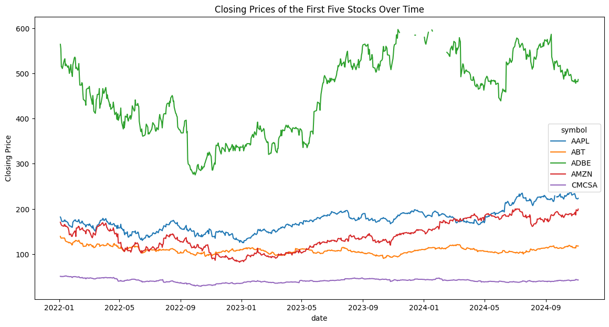
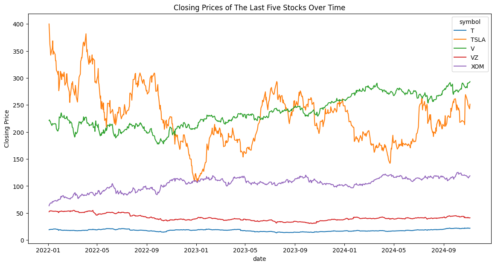
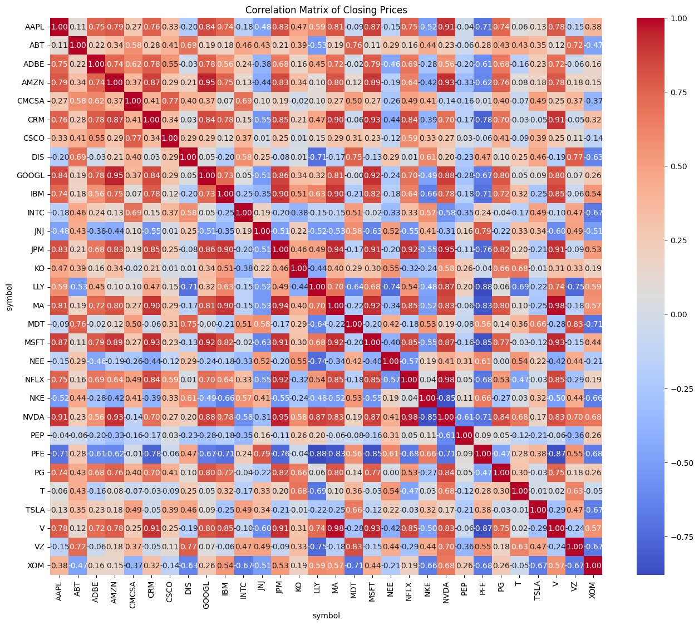
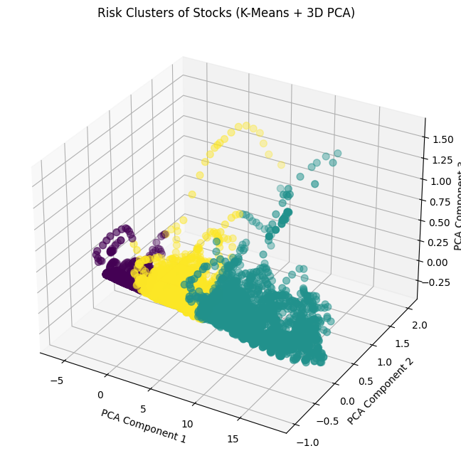

# Stock Investment Recommendation System

This repository contains a machine learning-based stock recommendation system developed to provide personalized stock suggestions based on a customer's risk appetite. The project uses historical data from Yahoo.finance, clusters stocks into risk categories, and presents recommendations for low, medium, and high-risk portfolios.

## Business Understanding
Investors face various challenges when trying to choose the right stock to invest in:
- Complexities of financial markets and stock behavior
- Varied risk preferences across investors
- Mismatch between investor risk tolerance and portfolio composition
- Can lead to unintentional financial losses or missed growth
opportunities

The primary objective is to bridge the gap between investor risk tolerance and portfolio selection by providing stock recommendations based on the investor's risk appetite.

The primary stakeholders of the project are new investors seeking to invest but are unsure about their risk level.

The business questions we will be trying to answer are:
1. How can we categorize stocks into different risk levels that align with investor preferences?
2. How can we personalize stock recommendations based on each customer's risk appetite?
3. What data-driven insights can we provide to customers to increase their confidence in the recommended stocks?
4. What metrics should be used to evaluate the success of the recommendations (e.g., customer satisfaction, portfolio performance, customer retention)?

## Data Understanding
The dataset obtained from Yahoo Finance contains historical stock price data for various companies. This data typically includes daily trading information, which is crucial for analyzing stock performance, volatility, and market trends. The dataset spans the last two years to the current date, allowing for comprehensive analysis of stock behavior over time.

### Structure of the Dataset
The dataset contains the following columns:
1. **Open**: The price at which the stock opened for trading on a given day.
2. **High**: The highest price reached during the trading session.
3. **Low**: The lowest price recorded during the trading session.
4. **Close**: The price at which the stock closed at the end of the trading day.
5. **Adj Close**: The adjusted closing price that accounts for any corporate actions (like stock splits and dividends) to reflect the stock's true value.
6. **Volume**: The total number of shares traded during the day, providing insights into market activity and liquidity.
7. **Beta**: A measure of a stock's volatility in relation to the market, indicating how much the stock's price is expected to move compared to a broader index (like the S&P 500).
8. **Date**: The exact date and time of the stock details
9. **Symbol**: The ticker of the company whose stock details are recorded.

## Data Analysis
This section handles some exploratory analysis done on the data. The following visual displays the closing prices of the first five stocks alphabetically across two years: .
The next visual displays the closing prices of the last five stocks alphabetically across two years:

A correlation heatmap was plotted to see the correlation between the closing prices of all 30 companies:

Further analysis was done on tableau using an interactive dashboard found here:
https://public.tableau.com/views/Book1_17313034867730/Sheet5?:language=en-US&publish=yes&:sid=&:redirect=auth&:display_count=n&:origin=viz_share_link

## Data Preparation
A function was to remove outliers based on Z-scores. This technique identifies outliers by calculating the Z-score for each value in specified columns. If a Z-score is above the threshold(3), the value is considered an outlier and removed. The dataset did not contain duplicates. The data did not originally contain missing values. 
## Feature Engineering
New features such as volatility, Bollinger bands (upper and lower), the moving averages i.e EMA and SMA, RSI were created using the already existing columns. This features would then be used during modelling.
The objective was to identify features that are highly correlated with the target features (adj_close, BB_Upper, and BB_Lower) to retain only the most relevant features for further analysis and modeling.  Only features with a correlation above the threshold (0.5) across all targets were selected.

## Modelling
Before modelling was done, scaling an PCA was used for dimensionality reduction. During PCA the number of components chosen was 3. K-Means clustering was used to group the stocks into three clusters (Low Risk, Medium Risk and High Risk). This is how the clusters looked: . The model achieved a silhouette score of approximately 0.6 which indicates that the clusters were quite distinct but there is room for improvement. Hierarchical agglomerative clustering was also used and the model achieved a silhouette score of 0.55 which is worse than the k-means clustering model. Hence, we settled on using the k-means clustering model.

## Evaluation
The silhouette score was the metric of choice in determining the model to be used. The silhouette score is a good indicator of the quality of clusters formed by measuring how similar points are within a cluster and how different it is to other clusters. The k-means clustering model achieved a silhouette score of around 0.6 which is good but there is room for improvement in determining the clusters.

## Deployment
A web application was created using HTML, CSS, JavaScript and Flask that allows the user to select their risk appetite and obtain recommendations based on the risk level selected. The application can be accessed by running the app.py script and opening the link at http://127.0.0.1:5000.
## Conclusion
From the project we can see it is possible to provide personalized stock recommendations to a user based on their risk appetite. The K-means model had a higher silhouette score of 0.6 which indicates a decent quality of clusters that could be improved in the future. A web application was created using HTML, CSS, JavaScript and Flask that allows the user to select their risk appetite and obtain recommendations based on the risk level selected.

## Future Recommendations
- Time Series predictions can be incorporated - Predict stock opening and closing prices based on historical trends to give the user more detail on what is the correct stock to invest in.
- Classification of user’s risk tolerance based on a series of questions including current financial status and their personality as an individual can improve the recommendations of the stocks.

